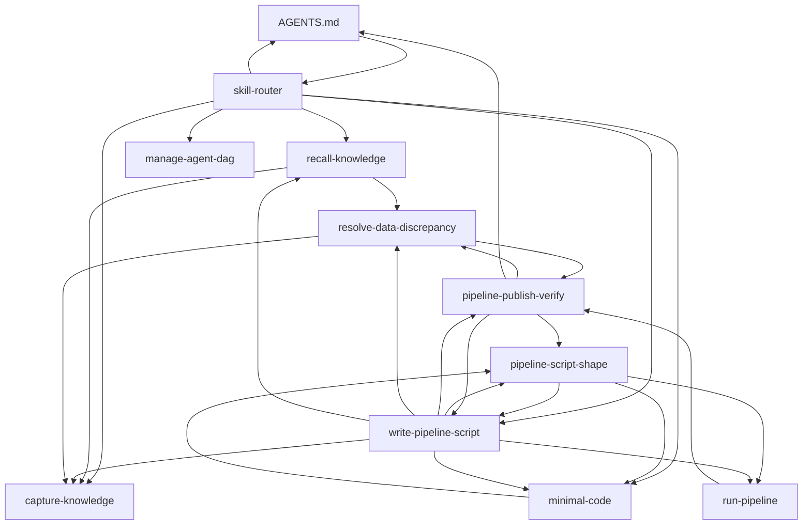

# manage-agent-dag

`.agents/skills/*/SKILL.md`가 서로 마크다운 링크로 참조하는 관계를 mermaid로 관리한다.
사람과 에이전트가 skill 구조를 한눈에 보게 하는 게 목적이다.

## 절차

1. `.agents/skills/*/SKILL.md`와 `AGENTS.md`를 전부 읽고, 본문의 `[텍스트](경로/SKILL.md)` 링크를 그대로 엣지로 뽑는다 — 관계를 새로 정의하지 않는다. 이 링크들이 SSOT다.
2. 아래 "현재 그래프"를 방금 뽑은 엣지로 다시 쓴다.
3. 다음만 보고한다. **자동으로 다른 skill의 내용을 고치지 않는다** — 어떤 링크를 끊거나 어느 skill을 합칠지는 설계 판단이라 사람이 정한다.
   - **고아 skill**: 어떤 skill도, AGENTS.md도 참조하지 않는 skill.
   - **깨진 링크**: 가리키는 파일이 없는 링크.
   - **순환**: 참고용으로만 나열한다 — 진입점 skill(`write-pipeline-script` 등)이 세부 skill과 서로 링크하는 건 정상이다(진입점→세부, 세부→진입점 왕복 안내). 문제인 순환인지는 사람이 판단한다.

## 언제 쓰나

- skill을 추가/삭제/이름 변경했을 때 그래프를 갱신한다.
- 전체 skill 구조를 한눈에 보고 싶을 때.

## 현재 그래프

- 고아 skill: 없음.
- 깨진 링크: 없음.
- 순환(전부 진입점↔세부 왕복이라 정상): `AGENTS`↔`skill-router`, `write-pipeline-script`↔`pipeline-script-shape`, `write-pipeline-script`↔`pipeline-publish-verify`, `pipeline-script-shape`↔`minimal-code`, `resolve-data-discrepancy`↔`pipeline-publish-verify`.
